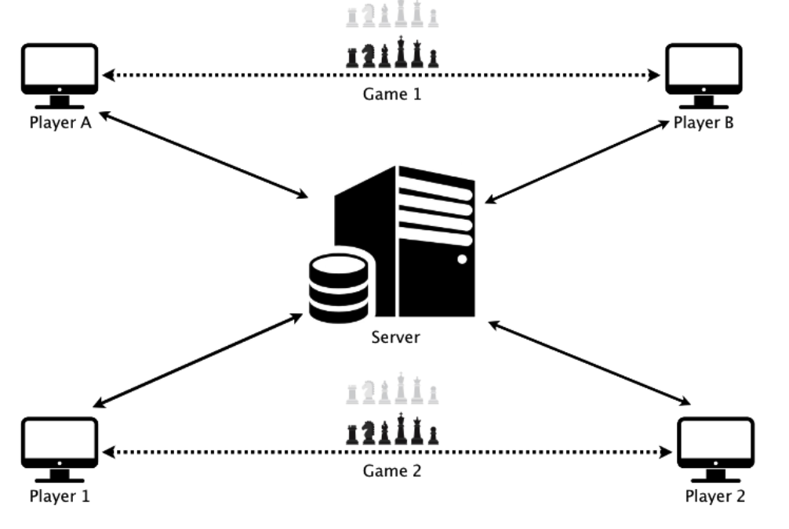

# VSV-Chess
Online Multiplayer Chess Game

Softwares Used :
1. Front end : 
* HTML
* CSS
* Javascript
2. Back end : 
* Node using Javascript (socket.io and express.js)

### Architecture

### Frontend
