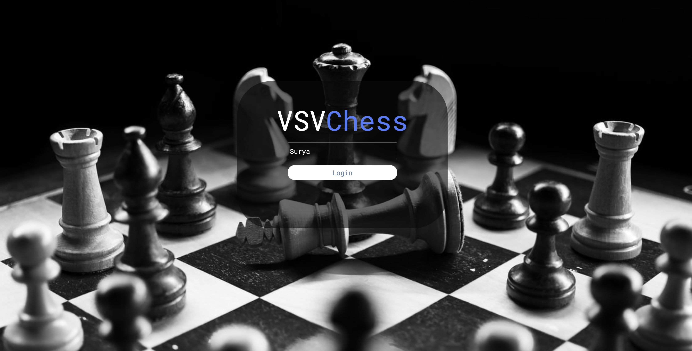
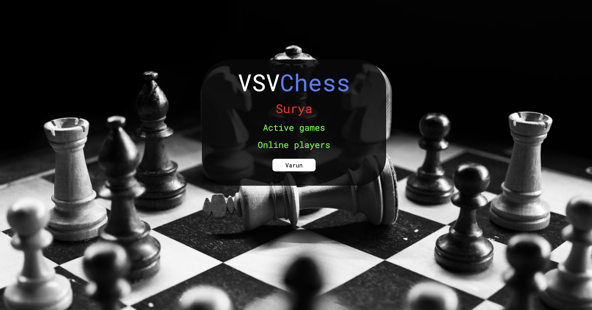
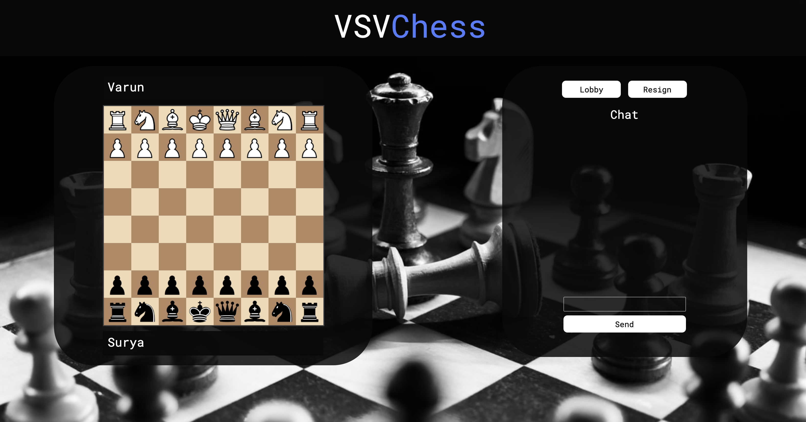

# VSV-Chess
Online Multiplayer Chess Game

### Softwares Used :
1. Front end :
* HTML
* CSS
* Javascript
2. Back end :
* Node using Javascript (socket.io and express.js)

### Architecture

### Frontend

For more information, check out my website [here](https://suryadheeshjith.tech/projects/2020-02-04-VSV_Chess/)

### Authors
1. Surya Dheeshjith
2. Varun Komperla
3. Vishak Bharadwaj
